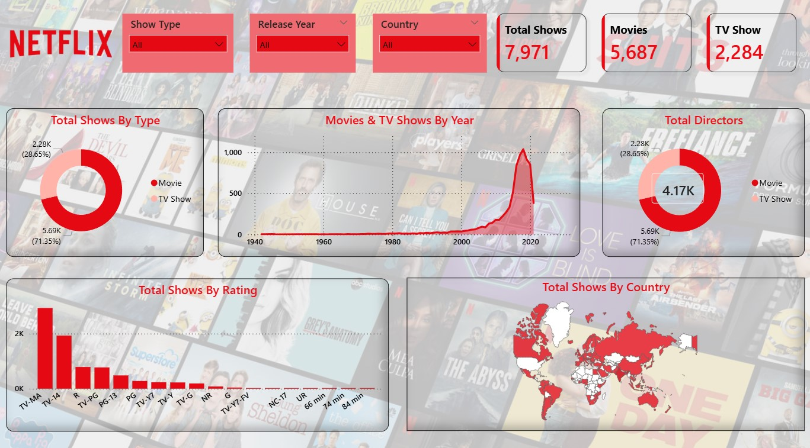

# 🎬 Netflix Content Analysis Dashboard

## 🎯 Objective

To analyze Netflix movies and TV shows using an interactive dashboard and uncover key content trends.

---

## 🛠️ Tools Used

* Power BI

---

## 📂 Dataset

The dataset includes:

* Title and type (Movie/TV Show)
* Genre
* Country
* Release year
* Ratings

---

## 🔍 Project Workflow

* Data cleaning and transformation in Power BI
* Created interactive dashboard with slicers and filters
* Designed KPIs to track content distribution
* Visualized trends across genres, countries, and years

---

## 📈 Key Insights

* Distribution of movies vs TV shows
* Popular genres and content trends
* Country-wise content production
* Growth of content over the years

---

## 📊 Dashboard Preview




---

## 🚀 Conclusion

The dashboard provides a clear and interactive way to explore Netflix content trends and supports data-driven insights.

---

## 📁 Project Structure

```
Netflix-Content-Analysis/
│── Netflix_Dashboard.pbix
│── images/
│     ├── dashboard1.png
│     ├── dashboard2.png
│     ├── dashboard3.png
│── README.md
```
